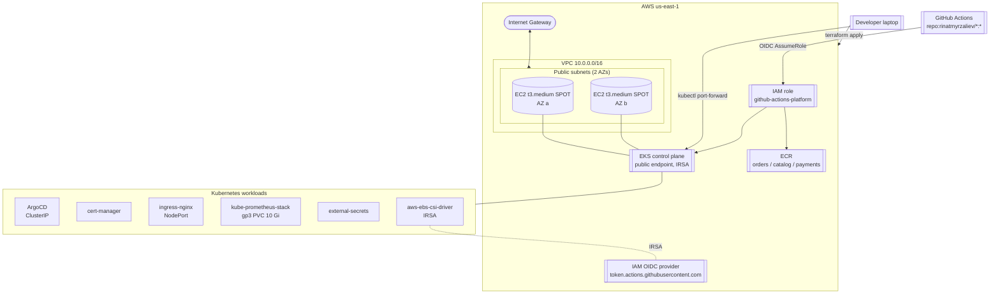

# Architecture

## Diagram

## Layer map

| Layer              | What lives here                                                              |
|--------------------|------------------------------------------------------------------------------|
| Networking         | 1 VPC, 2 public subnets, IGW. No private subnets, no NAT (ADR-001).          |
| Compute            | 1 EKS managed node group `workers-spot`, AL2023, t3.medium spot, scale 0..5. |
| Cluster services   | vpc-cni, kube-proxy, coredns, aws-ebs-csi-driver (IRSA).                     |
| Platform addons    | argo-cd, cert-manager, ingress-nginx, kube-prometheus-stack, external-secrets. |
| Identity           | EKS OIDC provider for IRSA; separate IAM OIDC for GitHub Actions.            |
| Registry           | 3 ECR repos with scan-on-push and lifecycle policy.                          |

## Data & traffic flow

- **Developer → cluster**: `kubectl` hits the EKS public endpoint. ArgoCD/Grafana UIs are reached via `kubectl port-forward` (ADR-004).
- **Pod egress**: each worker has a public IP; pods egress through the node ENI straight to the IGW.
- **Pod → AWS APIs**: via IRSA. EBS CSI controller assumes `platform-sandbox-ebs-csi` for volume provisioning.
- **GitHub Actions → AWS**: the workflow exchanges its GitHub-issued OIDC token for STS credentials against `github-actions-platform`. That role has ECR power-user + `eks:DescribeCluster`/`ListClusters`, enough to push images and run `aws eks update-kubeconfig`.
- **Prometheus storage**: gp3 StorageClass (default) backs the 10 Gi PVC from `kube-prometheus-stack`. 7-day retention.

## What's wired but intentionally not exposed

- **ingress-nginx** runs as NodePort. Nothing maps the NodePort to the public internet by default — you'd open node SG rules explicitly to do that.
- **cert-manager** is installed but no `ClusterIssuer` is created yet. Add Let's Encrypt / ACM PCA issuers when you actually need certs.
- **external-secrets** runs without any `SecretStore` configured. Wire to AWS Secrets Manager / SSM Parameter Store per-workload when needed.
- **alertmanager** is enabled but has no receivers configured. Add Slack/PagerDuty routing in a follow-up values file.
